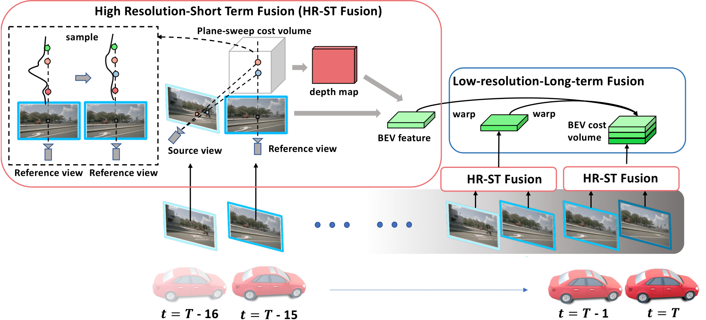

<div align="center">

# Time Will Tell: New Outlooks and A Baseline for Temporal Multi-View 3D Object Detection
</div>

<p align="center">
    
</p>

## News!
- [2022/10/6]: SOLOFusion achieves SOTA on Camera-Only [nuScenes Detection Task](https://nuscenes.org/object-detection?externalData=all&mapData=all&modalities=Camera) with **54.0% mAP** and **61.9% NDS**!
- [2022/10/5]: Paper released on [arXiv](https://arxiv.org/abs/2210.02443).

## Abstract
While recent camera-only 3D detection methods leverage multiple timesteps, the limited history they use significantly hampers the extent to which temporal fusion can improve object perception. Observing that existing works' fusion of multi-frame images are instances of temporal stereo matching, we find that performance is hindered by the interplay between 1) the low granularity of matching resolution and 2) the sub-optimal multi-view setup produced by limited history usage. Our theoretical and empirical analysis demonstrates that the optimal temporal difference between views varies significantly for different pixels and depths, making it necessary to fuse many timesteps over long-term history. Building on our investigation, we propose to generate a cost volume from a long history of image observations, compensating for the coarse but efficient matching resolution with a more optimal multi-view matching setup. Further, we augment the per-frame monocular depth predictions used for long-term, coarse matching with short-term, fine-grained matching and find that long and short term temporal fusion are highly complementary. While maintaining high efficiency, our framework sets new state-of-the-art on nuScenes, achieving first place on the test set and outperforming previous best art by **5.2\% mAP** and **3.7\% NDS** on the validation set.

## BibTeX
If this work is helpful for your research, please consider citing:
```
@article{Park2022TimeWT,
  title={Time Will Tell: New Outlooks and A Baseline for Temporal Multi-View 3D Object Detection},
  author={Park, Jinhyung and Xu, Chenfeng and Yang, Shijia and Keutzer, Kurt and Kitani, Kris and Tomizuka, Masayoshi and Zhan, Wei},
  journal={arXiv preprint arXiv:2210.02443},
  year={2022}
}
```

Code will be released soon.
